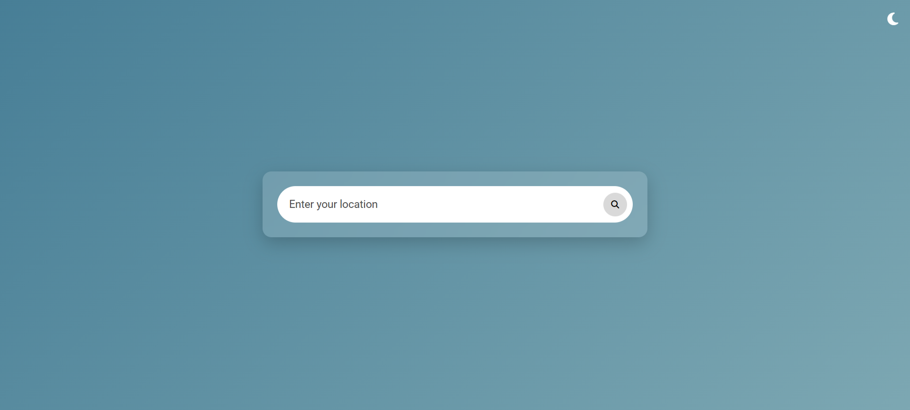
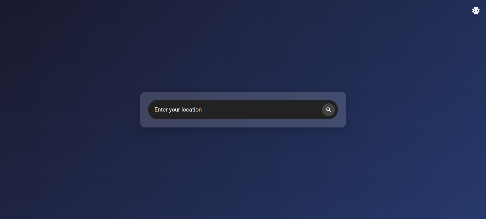

# Weather App

## Description

A dynamic **Weather App** built using **HTML, CSS, and JavaScript**. This app fetches real-time weather data using the **OpenWeather API**, provides **5-day forecasts**, and features a **dark mode toggle** for an enhanced user experience.

## Features

- 🌍 **Real-time weather updates** based on city input

- ⏳ **5-day weather forecast** with temperature and conditions

- ☀️ **Displays temperature, humidity, wind speed, and weather condition**

- 🎨 **Beautiful gradient backgrounds** that change dynamically based on weather conditions

- 🌙 **Dark mode toggle** with smooth transitions

- 🔧 **Error handling for invalid locations**

- 📱 **Animated UI elements** for a modern user experience

## Technologies Used

- **HTML** – Structure of the web pages

- **CSS** – Styling, animations, and responsive design

- **JavaScript** – API calls, dynamic content updates, and interactivity

- **OpenWeather API** – Fetches real-time weather data

## Installation

To run this project on your local machine:

1. Clone the repository:

>git clone https://github.com/paridhis05/Weather-App.git

2. Navigate to the project folder:

>cd weather-app

3. Open the **index.html** file in a web browser.

## Usage

1. **Enter a city name** in the input field and press enter or click the search icon.

2. **View real-time weather data** including temperature, humidity, wind speed, and conditions.

3. **Check the 5-day forecast** for upcoming weather trends.

4. **Switch between light and dark mode** using the moon/sun toggle.

5. If the location is invalid, an **error message** will be displayed.

## Screenshots

")

")

")

")

")

")

## API Setup

This app uses the OpenWeather API. To use it, follow these steps:

1. Sign up at OpenWeather and get a free API key.

2. Replace API_KEY in script.js with your own key:
>const API_KEY = "your_api_key_here";

## Contributing

Want to enhance this project? Follow these steps:

- Fork the repository.

- Create a new branch (feature-branch)

- Commit your changes (git commit -m 'Added a new feature')

- Push the changes (git push origin feature-branch)

- Open a Pull Request